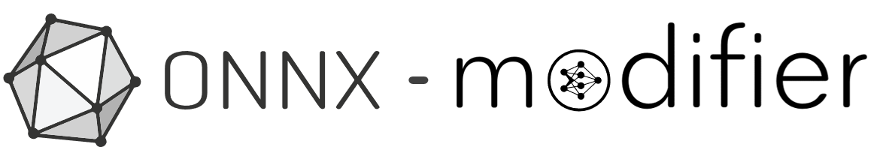
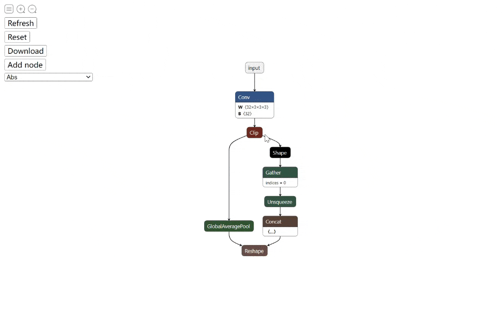
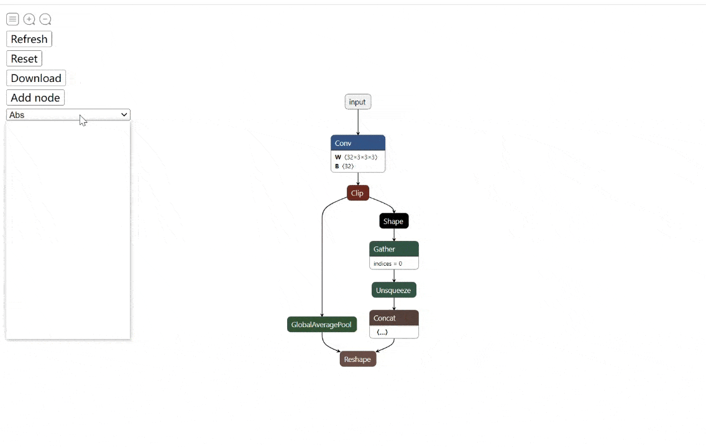
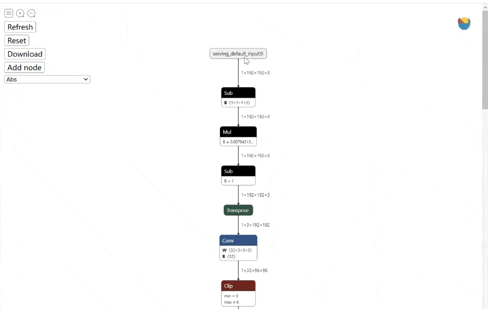
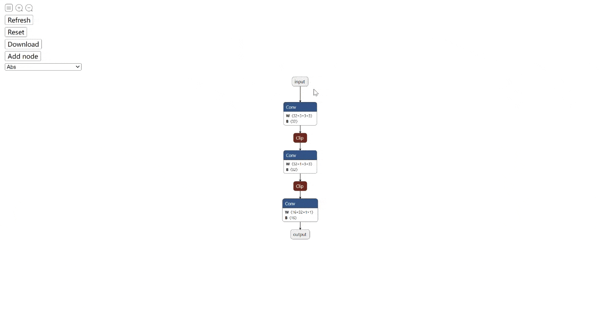
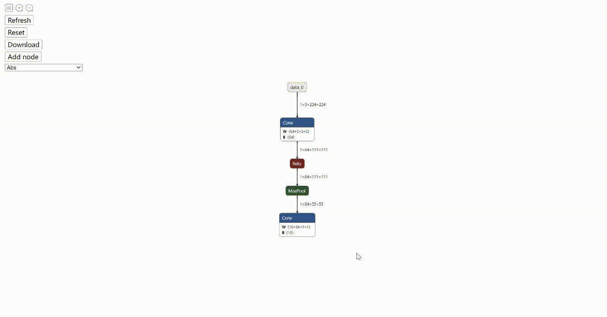
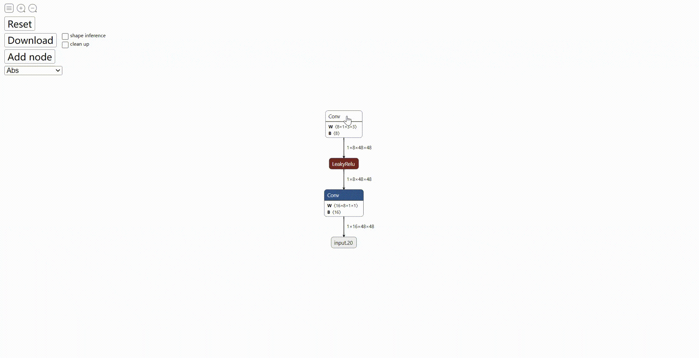
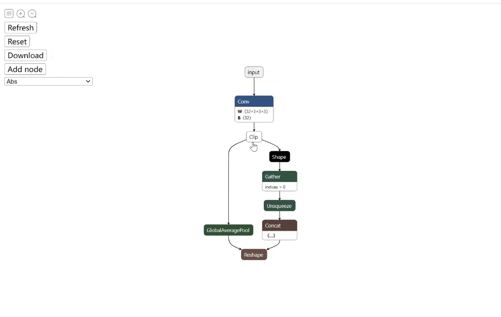
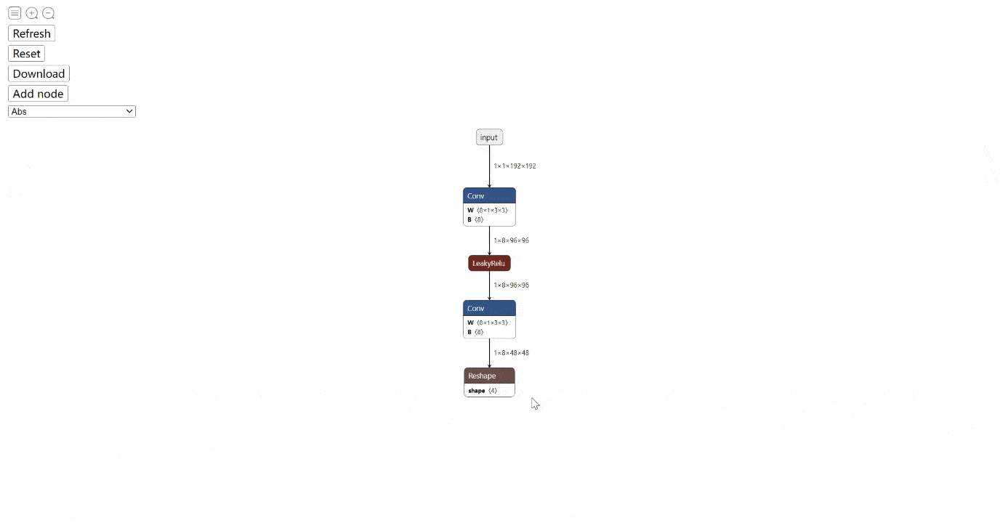
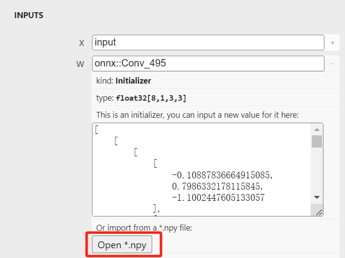

English | [简体中文](README_zh-CN.md)

# Introduction

To edit an ONNX model, one common way is to visualize the model graph, and edit it using ONNX Python API. This works fine. However, we have to code to edit, then visualize to check. The two processes may iterate for many times, which is time-consuming. 👋

What if we have a tool, which allows us to **edit and preview the editing effect in a totally visualization fashion**?

Then `onnx-modifier` comes. With it, we can focus on editing the model graph in the visualization pannel. All the editing information will be summarized and processed by Python ONNX API automatically at last. Then our time can be saved! 🚀

`onnx-modifier` is built based on the popular network viewer [Netron](https://github.com/lutzroeder/netron) and the lightweight web application framework [Flask](https://github.com/pallets/flask).

Currently, the following editing operations are supported:

:white_check_mark: [Delete nodes](#delete-nodes)<br>
:white_check_mark: [Add new nodes](#add-new-nodes)<br>
:white_check_mark: [Rename the node inputs and outputs](#rename-the-node-inputs-and-outputs)<br>
:white_check_mark: [Rename the model inputs and outputs](#rename-the-model-inputs-and-outputs)<br>
:white_check_mark: [Add new model outputs](#add-new-model-outputs)<br>
:white_check_mark: [Add new model inputs](#add-new-model-inputs)<br>
:white_check_mark: [Edit model input shape](#edit-model-input-shape)<br>
:white_check_mark: [Edit attribute of nodes](#edit-attribute-of-nodes)<br>
:white_check_mark: [Edit model initializers](#edit-model-initializers)<br>

Here is the [update log](./docs/update_log.md) and [TODO list](./docs/todo_list.md). Here is the [design overview](https://github.com/ZhangGe6/onnx-modifier/wiki), which may be helpful for someone who wants to contribute to this project.

Hope it helps!

# Getting started

We have three methods to launch `onnx-modifier` now.

## launch from installed wheel
Install the pre-built wheel
```bash
pip install onnx-modifier
```
Then run
```bash
onnx-modifier
```

## launch from source code
Clone the repo and install the required Python packages by

```bash
git clone https://github.com/ZhangGe6/onnx-modifier.git
cd onnx-modifier

pip install -r requirements.txt
```

Then run

```bash
python entry.py
```

Click the url in the output info generated by flask (defaults to `http://127.0.0.1:5000/`), then `onnx-modifier` will be launched in the web browser.

## launch from executable file
<details>
  <summary>Click to expand</summary>

- Windows: Download onnx-modifier.exe (28.3MB) [Google Drive](https://drive.google.com/file/d/1LRXgZauQ5BUENe_PvilRW8WvSO-4Jr9j/view?usp=sharing) / [Baidu NetDisk](https://pan.baidu.com/s/1ZUWP615F9EcsHQLijCCmQA?pwd=vh32), double-click it and enjoy.
  - Edge browser is used for runtime environment by default.

> I recorded how I made the the executable file in `app_desktop.py`. The executable file for other platforms are left for future work.

</details>

Click `Open Model...` to upload the ONNX model to edit. The model will be parsed and shown on the page.

# Usage

Graph-level-operation elements are placed on the left-top of the page. Currently, there are three buttons:  `Reset`, `Download` and `Add node`. They can do:
- `Reset`: Reset the whole model graph to its initial state;
- `Download`: Save the modified model into disk. Note the two checkboxes on the right
  - (**experimental**) select `shape inference` to do [shape inference](https://github.com/onnx/onnx/blob/main/docs/ShapeInference.md) when saving model.
    - The `shape inference` feature is built on [onnx-tool](https://github.com/ThanatosShinji/onnx-tool), which is a powerful ONNX third-party tool.
  - (**experimental**)  select `clean up` to remove the unused nodes and tensors (like [ONNX GraphSurgeon](https://docs.nvidia.com/deeplearning/tensorrt/onnx-graphsurgeon/docs/ir/graph.html#onnx_graphsurgeon.Graph.cleanup)).
- `Add node`: Add a new node into the model.

Node-level-operation elements are all in the sidebar, which can be invoked by clicking a specific node.

Let's take a closer look.

## Delete nodes
There are two modes for deleting node: `Delete With Children` and `Delete Single Node`. `Delete Single Node` only deletes the clicked node, while `Delete With Children` also deletes all the node rooted on the clicked node, which is convenient and natural if we want to delete a long path of nodes.

> The implementation of `Delete With Children` is based on the backtracking algorithm.

For previewing, The deleted nodes are in grey mode at first. If a node is deleted by mistake, `Recover Node` button can help us recover it back to graph. Click `Enter` button to take the deleting operation into effect, then the updated graph will show on the page automatically.

The following figure shows a typical deleting process:



## Add new nodes
Sometimes we want to add new nodes into the existed model. `onnx-modifier` supports this feature experimentally now.

Note there is an `Add node` button, following with a selector elements on the top-left of the index page. To do this, what we need to do is as easy as 3 steps:

1. Choose a node type in the selector, and click `Add node` button. Then an empty node of the chosen type will emerge on the graph.

   > The selector contains all the supported operator types in domains of `ai.onnx`(171), `ai.onnx.preview.training`(4), `ai.onnx.ml`(18) and `com.microsoft`(1).

2. Click the new node and edit it in the invoked siderbar. What we need to fill are the node Attributes (`undefined` by default) and its Inputs/Outputs (which decide where the node will be inserted in the graph).

3. We are done.



The following are some notes for this feature:

1. By clicking the `?` in the `NODE PROPERTIES -> type` element, or the `+` in each `Attribute` element, we can get some reference to help us fill the node information.

2. It is suggested to fill all of the `Attribute`, without leaving them as `undefined`.  The default value may not be supported well in the current version.

3. For the `Attribute` with type `list`, items are split with '`,`' (comma). Note that `[]` is not needed.

4. For the `Inputs/Outputs` with type `list`, it is forced to be at most 8 elements in the current version. If the actual inputs/outputs number is less than 8, we can leave the unused items with the name starting with `list_custom`, and they will be automatically omitted.

## Rename the node inputs and outputs

By changing the input/output name of nodes, we can change the model forward path. It can also be helpful if we want to rename the model output(s).

Using `onnx-modifier`, we can achieve this by simply enter a new name for node inputs/outputs in its corresponding input placeholder. The graph topology is updated automatically and instantly, according to the new names.

For example,  Now we want remove the preprocess operators (`Sub->Mul->Sub->Transpose`) shown in the following figure. We can

1. Click on the 1st `Conv` node, rename its input (X) as *serving_default_input:0* (the output of node `data_0`).
2. The model graph is updated automatically and we can see the input node links to the 1st `Conv`directly. In addition, the preprocess operators have been split from the main routine. Delete them.
3. We are done! (click `Download`, then we can get the modified ONNX model).

> Note: To link node $A$ (`data_0` in the above example) to node $B$ (the 1st `Conv` in the above example), **it is suggested to edit the input of node $B$ to the output of node `A`, rather than edit the output of node $A$ to the input of node `B`.** Because the input of $B$ can also be other node's output (`Transpose`  in the above example ) and unexpected result will happen.

The process is shown in the following figure:



## Rename the model inputs and outputs
Click the model input/output node, type a new name in the sidebar, then we are done.



## Add new model outputs

Sometimes we want to set the output of a certain node as model output. For example, we want to extract intermediate layer output for fine-grained analysis. In `onnx-modifier`, we can achieve this by simply clicking the `Add Output` button in the sidebar of the corresponding node. Then we can get a new model output node following the corresponding node. Its name is the same as the output of the corresponding node.

In the following example, we add 2 new model outputs, which are the outputs of the 1st `Conv` node and 2nd `Conv` node, respectively.



## Add new model inputs

Sometimes we need to add inputs to a model (such as a sub-model extracted from an original model). In `onnx-modifier`, we can achieve it by:
1. Clicking the node to add input, and click the "Add Input" button in the invoked sidebar.
2. In the poped dialog, choose the input name in the selector, and input its shape. Then cilck "confirm".
3. We are done.



> Note: The input shape is supposed in "dtype[dim0, dim1, ...]" format, like "float32[1,3, 224,224]". Otherwise Warning shows and the "confirm" button is disabled. In addition, sometimes the input shape can be pre-filled by analysing the model (we can trust it). If not, we should set it manually.

## Edit attribute of nodes

Change the original attribute to a new value, then we are done.

> By clicking the `+` in the right side of placeholder, we can get some helpful reference.



## Edit model input shape
`onnx-modifier` supports editting input shape now. Click the target model input, then click the `Change input shape (static)` button. In the popped dialog, set a new shape for the input and click "confirm". The downsrteam tensor shape will be updated in the downloaded modified model (rather than in the pannel instantly, as the shape inference process is applied after "Download" is clicked).

`onnx-modifier` also supports changing input to be dynamic. Currently only the batch dimension is supported. Just click the `Set dynamic batch size` button, then we get a model which supports dynamic batch size inference.

## Edit model initializers
Sometimes we want to edit the values which are stored in model initializers, such as the weight/bias of a convolution layer or the shape parameter of a `Reshape` node. `onnx-modifier` supports this feature now! Input a new value for the initializer in the invoked sidebar and click Download, then we are done.



> Note: For the newly added node, we should also input the datatype of the initializer. (If we are not sure what the datatype is, click `NODE PROPERTIES->type->?`, we may get some clues.)

> The latest version (after 2023.12.10) supports reading initializer values from numpy file! Just click the "Open *.npy" button and select the numpy file, the values will be parsed and shown in the above placeholder. The values can be furtherly editted.



# Sample models

For quick testing, some typical sample models are provided as following. Most of them are from [onnx model zoo](https://github.com/onnx/models)

- squeezeNet [Link (4.72MB)](https://github.com/onnx/models/blob/main/vision/classification/squeezenet/model/squeezenet1.0-12.onnx)
- MobileNet [Link (13.3MB)](https://github.com/onnx/models/blob/main/vision/classification/mobilenet/model/mobilenetv2-7.onnx)
- ResNet50-int8 [Link (24.6MB)](https://github.com/onnx/models/blob/main/vision/classification/resnet/model/resnet50-v1-12-int8.onnx)
- movenet-lightning [Link (9.01MB)](https://pan.baidu.com/s/1MVheshDu58o4AAgoR9awRQ?pwd=jub9)
  - Converted from the pretrained [tflite model](https://tfhub.dev/google/movenet/singlepose/lightning/4) using [tensorflow-onnx](https://github.com/onnx/tensorflow-onnx);
  - There are preprocess nodes and a big bunch of postprocessing nodes in the model.

`onnx-modifier` is under active development 🛠. Welcome to use, create issues and pull requests! 🥰

# Credits and referred materials

- [Netron](https://github.com/lutzroeder/netron)
- [Flask](https://github.com/pallets/flask)
- ONNX IR [Official doc](https://github.com/onnx/onnx/blob/main/docs/IR.md)
- ONNX Python API [Official doc](https://github.com/onnx/onnx/blob/main/docs/PythonAPIOverview.md), [Leimao&#39;s Blog](https://leimao.github.io/blog/ONNX-Python-API/)
- ONNX IO Stream [Leimao&#39;s Blog](https://leimao.github.io/blog/ONNX-IO-Stream/)
- [onnx-utils](https://github.com/saurabh-shandilya/onnx-utils)
- [sweetalert](https://github.com/t4t5/sweetalert)
- [flaskwebgui](https://github.com/ClimenteA/flaskwebgui)
- [onnx-tool](https://github.com/ThanatosShinji/onnx-tool) 👍
- [Ascend/ait](https://gitee.com/ascend/ait)
