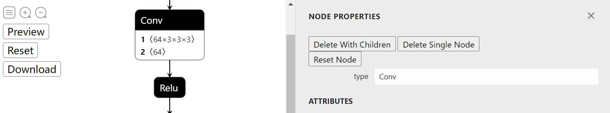

# Introduction

To edit an ONNX model, One common way is to visualize the model graph, and edit it using ONNX Python API. This works fine. However, we have to code to edit, then visualize to check. The two processes may iterate for many times, which is time-consuming.

What if we have a tool, which allow us **edit and preview the editing effect in a totally visualization fashion**? Then `onnx-modifier` comes. With it, we can focus on editing the model graph in the visualization pannel. Finally, all editing information will be summarized and  processed by Python ONNX automatically. Most importantly, our time will be saved!

`onnx-modifier` is built based on the popular network viewer [netron](https://github.com/lutzroeder/netron) and the lightweight web application framework [flask](https://github.com/pallets/flask). 

Currently, the following editing operations are supported:

- Delete a single node.
- Delete a node and all the nodes rooted with it.
- Recover/Reset a node.

Hope it helps!

# Get started

Install the require Python packages by

```bash
pip install onnx
pip install flask
```

Then run

```bash
python app.py
```

Click the url in the output info generated by flask (`http://127.0.0.1:5000/` for example), then `onnx-modifier` will be launched in the web browser. 

Click `Open Model...` to upload the onnx model to edit. The model will be parsed and show on the page.

# Edit



Graph-level-operation elements are placed on the left-top of the page. Currently, there are three buttons: `Preview`，`Reset` and `Download`. They can do:

- `Preview`：Preview the result model graph with all current modifications applied ；
- `Reset`：Reset the model graph to its initial state；
- `Download`：save the modified model file.

Node-level-operation elements are all in the side bar, which can be invoked by clicking a specific node. Let's take a look.

## Delete node

There are two modes (buttons) for deleting node: `Delete With Children` and `Delete Single Node`. `Delete Single Node` only deletes the clicked node, while `Delete With Children` also deletes all the node rooted on the clicked node, which is convenient and nature if we want to delete a long path of nodes. 

> The implementation of `Delete With Children` is based on backtracking algorithm.

The deleted nodes are in grey mode. The following figure shows a typical deleting process.


## Reset node

 By `Reset Node` button, we can set the clicked node to it initial state. It can be helpful when we want to recover the node after deleting it, or we want to reset its attributes. 

## Change the input/output name of node

By changing the input/output name of nodes, we can change the model forward routine. It can also be helpful if we want to rename the model output(s).

`onnx-modifier` is under active development. Welcome to use, create issues and pull requests.


# Credits and referred materials

