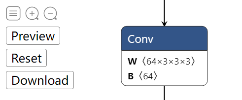
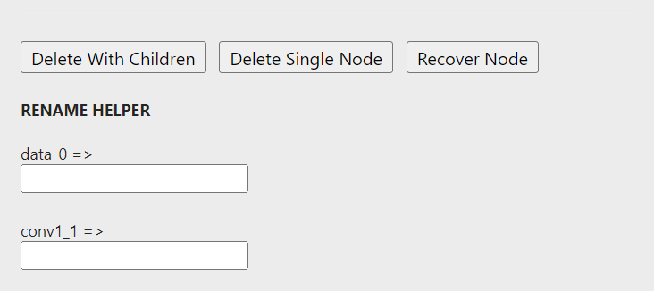
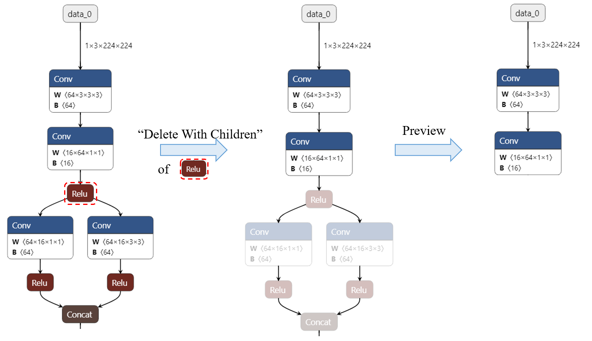
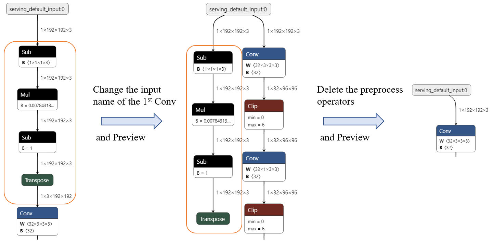

简体中文 | [English](readme.md)

`ONNX`(Open Neural Network Exchange) 是一种针对机器学习所设计的开放式的文件格式，经常作为不同框架模型转化的中间文件。有时我们拿到ONNX文件，想将它进行一些修改，比如：

- **删除部分节点**。 比如，`ONNX`文件中一些前后处理的算子节点。
- **增加节点**。
- **修改节点属性**。 比如修改某一节点的输入输出名称。

目前常用的方法是，先可视化模型图结构，然后基于`ONNX`的Python API编写脚本，对模型图结构进行编辑。但这可能需要我们在可视化-脚本-可视化-...之间反复横跳。而且在一张庞大的图上搜集想要修改的节点，也比较花时间。

能不能有一个工具，可以**实时预览编辑后的可视化效果，从而更方便，快捷，直观地实现`ONNX`模型的编辑**呢？:rocket: 这便是`onnx-modifier` ([github]())开发的动机。所有的编辑信息将最终汇总，统一送由ONNX Python处理，得到编辑后的ONNX模型文件。

`onnx-modifier`基于流行的模型可视化工具 [Netron](https://github.com/lutzroeder/netron) 和轻量级Web应用框架 [flask](https://github.com/pallets/flask) 开发。希望它能给社区带来一些贡献~

# 安装与运行

- 拉取`onnx-modifier`，安装所需要的Python库 

  ```bash
  git clone git@github.com:ZhangGe6/onnx-modifier.git
  cd onnx-modifier
  
  pip install onnx
  pip install flask
  ```

- 运行 

  ```bash
  python app.py
  ```

  点击输出中的url（如`http://127.0.0.1:5000/`），即可在浏览器中进入onnx-modifier界面。点击`Open Model...`，上传所需要编辑的模型文件，上传完毕后，网络可视化结构会自动显示。

# 编辑

<table>
    <tr>
        <td ><center> <b>图结构层级操作<br>（界面左上角）</b></center></td>
        <td ><center><b>节点层级操作（节点属性栏）</b></center></td>
    </tr>
</table>


图结构层级的操作按钮放置在可视化页面的左上角，有三个：`Preview`，`Reset`和`Download`. 它们的功能分别为：

- `Preview`：预览当前编辑得到的模型图结构；
- `Reset`：重置模型图结构为初始状态；
- `Download`：保存编辑后的模型文件到本地。

节点层级的操作都在节点属性栏里，点击某一节点后即可弹出，一起来康康。

## 删除节点

删除节点有两种模式：`Delete With Children` 和 `Delete Single Node`. 后者只删除当前单个节点；而前者还会自动删除以这个节点为根节点的所有节点，就不用一个一个删除啦。

> `Delete With Children`方法基于回溯算法实现。

被删除的节点会变灰显示。删除节点的效果如下：




## 重置节点

在节点对应的属性栏点击`Recover Node`按钮，可将被删除的节点重新恢复到图中。

## 修改节点输入输出名称

通过修改节点的输出输出名，我们可以对模型推理图进行修改（如删除一些预处理/后处理节点）。该功能同样可以用在更改模型的输出的名称（即修改模型叶子节点的输出名）。

那在`onnx-modifer`中要怎么做呢？在节点属性栏中有一个`RENAME HELPER`小节。当前节点的全部输入/输出名都会列在这里（不包含模型权重），每个输入/输出名后面跟着一个输入框，直接在对应的输入框中，键入新的名称就可以啦。

比如，在下图所示的模型中，我们想要删除预处理对应的节点（`Sub->Mul->Sub->Transpose`），可以这样做：

1. 点击第一个`Conv`节点，在弹出的属性栏中，将输入名称改为*serving_default_input:0*；
2. 预览一下，发现输入已经和第一个`Conv`直接相连，几个预处理节点也已经从前向图中分离出来，将它们删除；
3. 完工，预览check一下（点击`Download`就可以获得编辑后的ONNX模型啦）。



`onnx-modifer`正在活跃地更新中:hammer_and_wrench:。 欢迎使用，提issue，如果有帮助的话，感谢给个:star:~

# 示例模型文件

为方便测试，以下提供一些典型的样例模型文件，主要来自于[onnx model zoo](https://github.com/onnx/models)

- squeezeNet [链接 (4.72MB)](https://github.com/onnx/models/blob/main/vision/classification/squeezenet/model/squeezenet1.0-12.onnx)
- MobileNet [链接 (13.3MB)](https://github.com/onnx/models/blob/main/vision/classification/mobilenet/model/mobilenetv2-7.onnx)
- ResNet50-int8 [链接 (24.6MB)](https://github.com/onnx/models/blob/main/vision/classification/resnet/model/resnet50-v1-12-int8.onnx)
- movenet-lightning [链接 (9.01MB)](https://pan.baidu.com/s/1MVheshDu58o4AAgoR9awRQ?pwd=jub9)
  - 将Google提供的预训练[tflite模型](https://tfhub.dev/google/movenet/singlepose/lightning/4)，使用[tensorflow-onnx](https://github.com/onnx/tensorflow-onnx)转换得到；
  - 模型中包含前处理和一大块后处理节点。

# 参考资料

- [Netron](https://github.com/lutzroeder/netron)
- [flask](https://github.com/pallets/flask)
- ONNX Python API [Official doc](https://github.com/onnx/onnx/blob/main/docs/PythonAPIOverview.md), [Leimao's Blog](https://leimao.github.io/blog/ONNX-Python-API/)
- ONNX IO Stream  [Leimao's Blog](https://leimao.github.io/blog/ONNX-IO-Stream/)
- [onnx-utils](https://github.com/saurabh-shandilya/onnx-utils)
- [sweetalert](https://github.com/t4t5/sweetalert)
